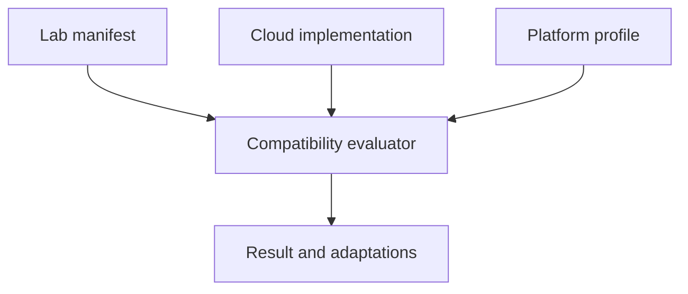

# Repository Architecture

## Core model

The repository uses four independently versioned concepts.

| Concept | Example | Responsibility |
| --- | --- | --- |
| Lab | `observable-serverless-api` | Defines portable goals, scenarios, and evidence. |
| Cloud implementation | `azure` | Maps the lab to concrete cloud services and code. |
| Sandbox platform profile | `pluralsight + azure` | Records restrictions, duration, quotas, and permissions. |
| Compatibility evaluation | Lab + implementation + profile | Produces compatible, conditional, unknown, or incompatible. |



## Why cloud and platform are separate

`Azure` identifies a cloud provider. `Pluralsight` identifies a learning platform that grants temporary Azure access. Whizlabs and O'Reilly may expose different Azure permissions, while Pluralsight also exposes AWS and GCP sandboxes.

Catalogs separate these concerns. The first Terraform module deliberately enforces
the Pluralsight allowlist as a safety constraint; another platform will need a
reviewed configuration variant, not merely a changed profile name:

```text
catalog/clouds/azure.json
catalog/platforms/pluralsight/azure.json
catalog/platforms/whizlabs/azure.json       # future
catalog/platforms/oreilly/azure.json        # future
```

## Lab organization

Each portable lab owns its learning outcomes and scenario. Cloud-specific code sits below `implementations/`.

```text
labs/observable-serverless-api/
├── lab.json
├── README.md
├── scenario.md                         # future
├── evidence-spec.md                    # future
└── implementations/
    ├── azure/
    │   ├── README.md
    │   ├── terraform/
    │   └── investigate.kql
    ├── aws/                            # future
    └── gcp/                            # future
```

The repository begins with Terraform because it supports all three target clouds and matches the project's platform-engineering focus. Cloud-native IaC such as Bicep, CloudFormation, and Google Cloud infrastructure tooling can be added as optional implementation variants.

The five Azure roots share `modules/function-workshop/` and `apps/workshop/`.
Repository-level scripts handle preflight, ZIP publishing, functional checks and
guarded cleanup. The local runner uses in-memory adapters while the deployed
Functions use actual Azure SDK adapters. See [ADR 0005](decisions/0005-five-small-runnable-projects.md).

## Data flow

1. A lab manifest declares portable capabilities and one or more cloud implementations.
2. The chosen implementation declares required cloud services and environmental requirements.
3. A platform profile records the sandbox's documented capabilities.
4. The compatibility tool compares requirements with the profile.
5. The learner reads blockers, conditions, and adaptations before provisioning.
6. Runtime preflight checks validate facts that documentation cannot guarantee, such as the supplied resource group, current region, and provider registration.

## Compatibility states

| Result | Meaning |
| --- | --- |
| `compatible` | All declared requirements are supported. |
| `compatible_with_conditions` | Supported, but quotas, SKUs, timing, or sandbox compromises apply. |
| `unknown` | The profile does not contain enough information; verify safely. |
| `incompatible` | A required service or capability is unavailable. |
| `design_only` | Valuable architecture content exists, but the target sandbox cannot execute the implementation. |

Compatibility is evidence for planning, not a guarantee. Sandbox vendors can change policy without notice, and actual regional capacity can differ.

## Documentation versus runtime discovery

The platform's published support table is the initial source of truth.
`scripts/Test-AzureSandbox.ps1` now checks the selected account, supplied group,
documented region, provider registrations and visible plan/search resource counts.
It does not prove all effective policies, permissions or service capacity. Further
read-only discovery could cover:

- Current account identity and scope.
- Available resource groups.
- Allowed locations.
- Registered resource providers.
- Selected quota and SKU availability.
- Read-only policy and role information when accessible.

The probe must sanitize subscription, tenant, account, and project identifiers before producing shareable evidence.

## Evidence model

Every implemented lab should define evidence that survives the sandbox:

- Sanitized command output.
- Deployment summary.
- Test results.
- Selected logs and metrics.
- Screenshots when necessary.
- Architecture decisions.
- Cleanup result.

Evidence is written outside Terraform state and excluded from Git by default. Curated synthetic examples can be committed under an explicit `examples/` directory.

## Future generated site

The JSON catalog can later generate a GitHub Pages site with filters for:

- Cloud.
- Sandbox platform.
- Compatibility.
- Domain.
- Time tier.
- Difficulty.
- Required services.
- Certification alignment.
- Lab maturity.

The source repository remains authoritative; the site is a derived presentation layer.
